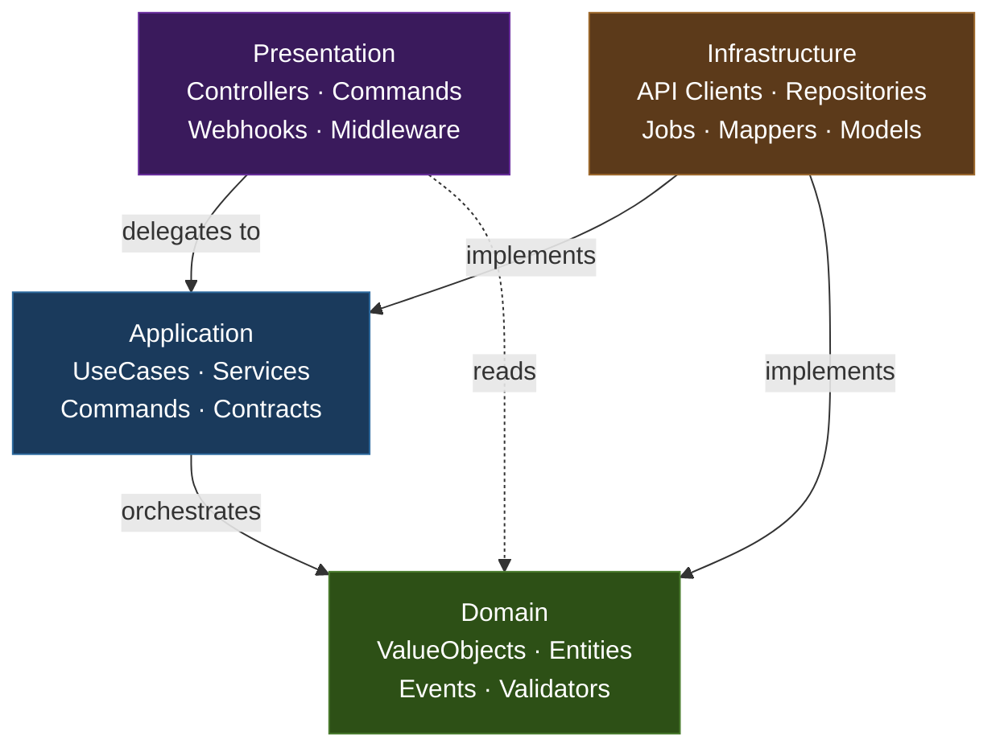
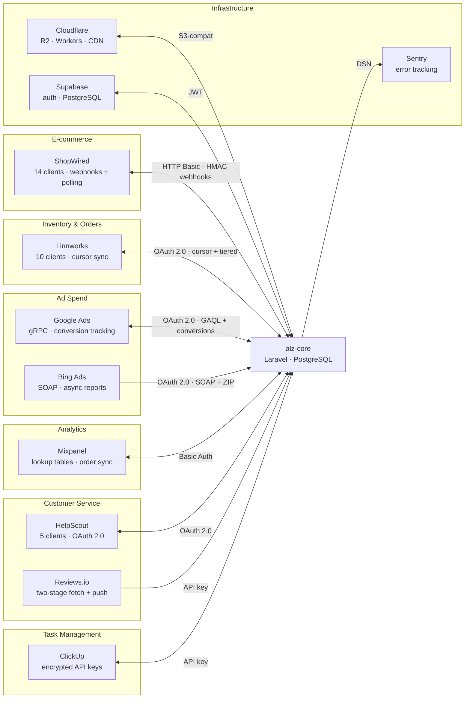

# alz-core

Production backend for a UK e-commerce business selling disability aids to individuals, businesses, and the public sector. The system orchestrates 11 third-party integrations, 73 queued jobs, and 57 scheduled tasks across inventory management, order processing, ad spend tracking, and customer service. All behind a mechanically enforced Clean Architecture. Built for correctness and maintainability in a small team, not horizontal scale.

> **Status:** Portfolio showcase. This repository is published for reference and is not accepting external contributions or issues.

## Table of Contents

- [Architecture](#architecture)
- [Key Engineering Decisions](#key-engineering-decisions)
- [Tech Stack](#tech-stack)
- [Integrations](#integrations)
- [Testing Strategy](#testing-strategy)
- [Development Workflow](#development-workflow)
- [CI/CD Pipeline](#cicd-pipeline)
- [Known Limitations & What's Next](#known-limitations--whats-next)

## Architecture

Layer boundaries are enforced by tooling, not discipline. PHPArkitect validates dependency rules across four layers on every commit, and 27 custom PHPStan rules enforce conventions beyond what built-in type checking can catch.

The result is a codebase where architectural violations are caught in the editor, not in code review.

**Enforcement tools:** PHPArkitect (layer dependencies) · PHPStan max level with bleeding edge · 99% type coverage target · Cognitive complexity limits · Disallowed calls (no facades in domain/application, no `DB::`, no `Artisan::call`)

**27 custom PHPStan rules** cover job resilience (`$tries`, `$timeout`, `backoff()`, `failed()` required on every job), exception taxonomy (domain exceptions must extend the base, infrastructure `@throws` must not reference vendor exceptions), complexity limits (20-line methods, 4-parameter cap, tiered class length by layer), and naming conventions enforced per layer.

## Key Engineering Decisions

### No caching layer — the database already is one

Started implementing Redis caching, then stopped to ask what it would actually gain. Most tables have their source of truth in a third-party system; regular syncs and webhooks mean PostgreSQL already provides the core benefit of a cache: fast local reads of remote data.

Evaluated the standard justifications and none applied to a small internal tool operating well within its resource limits, especially with Octane's persistent workers already providing fast response times and a high throughput ceiling:

- High throughput? Internal tool with 3-4 users.
- Ultra-fast customer-facing responses? Not customer-facing.
- Reducing database load? Nowhere near capacity.

The downsides (invalidation complexity, consistency bugs, solo-developer maintenance burden) far outweighed the only real benefit: slightly faster loads. Would add targeted caching when query performance degrades or when customer-facing features (e.g. delivery lead times) demand it.

### Webhook partial-save → re-fetch → reconcile

ShopWired webhook payloads are partial; the full entity must be re-fetched from the API regardless. Webhooks save the partial payload, return `200 OK` immediately to avoid timeouts, and dispatch a re-fetch job. Webhooks allowed us to significantly reduce polling frequency while keeping data accurate within tight external API rate limits.

Would revisit if ShopWired added complete payloads with guaranteed ordering.

### HelpScout SDK for writes, direct HTTP for reads

The SDK's entity hydration silently drops response fields on reads. The `snooze` field needed by all four dashboard widget types was being discarded. Writes work correctly through the SDK.

Rather than replacing the SDK entirely or working around it, the hybrid approach uses each path where it's reliable. Would revisit if HelpScout shipped an SDK version that preserves all response fields.

### Test implementation delegated to AI; mutation testing as the quality floor

Test writing was the only area of the codebase fully delegated to AI tooling. Architecture, design, and production code were collaborative. Critical business logic tests were developed together; the rest were AI-generated within testing guides and validated by Mutation Score Indicator (85%+ MSI domain, 70%+ MSI application).

- The trade-off is velocity over hand-crafted test design
- The realistic consequence is that test quality is uneven outside of core domain logic
- The mutation score, not coverage percentage, is the real quality gate

## Tech Stack

| Layer | Technology | Notes |
|-------|-----------|-------|
| Language | PHP 8.4 | Strict types, readonly properties, enums |
| Framework | Laravel 12 | Octane (Swoole) for HTTP serving |
| Database | PostgreSQL | Via Supabase; schema-qualified tables enforced by custom PHPStan rule |
| Queue | Redis + Laravel Horizon | 5 priority tiers, 3 Railway services (web, worker, scheduler) |
| Static Analysis | PHPStan max + bleeding edge | Larastan, shipmonk-rules, strict-rules, disallowed-calls, cognitive-complexity, type-coverage |
| Architecture | PHPArkitect | Layer dependency validation on every commit |
| Testing | Pest 4 + mutation testing | Layer-specific coverage targets, Pest Mutate (190+ mutators) |
| Deployment | Docker → Railway | Multi-stage build, Swoole runtime |
| Error Tracking | Sentry | Filtered by expected/unexpected; user context capture |
| Domain Invariants | webmozart/assert | Constructor-enforced value objects throughout domain layer |
| DTOs | Spatie Laravel Data | Presentation and application boundary DTOs; domain uses value objects |

## Integrations

The system connects to 11 external services, each with its own authentication model, rate limits, and data format quirks.

Sync runs on a tiered schedule: cursor-based incremental polling (every 1–5 minutes), hourly/daily catch-up sweeps, and weekly/monthly full reconciliation. 57 scheduled tasks across 10 dedicated schedule providers.

## Testing Strategy

Testing is organised by architectural layer, with coverage targets calibrated to where bugs are most costly.

| Layer | Targets | Focus |
|-------|---------|-------|
| Domain | 90%+ coverage, 85%+ MSI | Pure business logic. Mutation testing catches tests that pass without verifying behaviour. Value object invariants, validators, and transformers are the priority. |
| Application | 70%+ coverage, 70%+ MSI | UseCase orchestration, service logic, command handling. Tests verify branching logic and error paths. Pure-delegation UseCases excluded from coverage. |
| Infrastructure | Integration tests only | Live service tests where mocking would hide real failures. No mutation testing. |
| Presentation | Smoke + feature tests | HTTP endpoints, webhook signature verification, auth middleware, rate limiting, request validation. |

The philosophy: test what static analysis can't catch. With PHPStan at max level, 99% type coverage, and 27 custom rules, the type system handles a large class of bugs that other codebases rely on tests to find. Tests focus on business logic, state transitions, and integration boundaries.

## Development Workflow

**Branching:** Feature branches → `develop` → `main`, with linear history enforced via squash/rebase merges and GitHub branch protection rulesets preventing direct pushes.

**Feature development** scales with scope:

- **Small:** Scoped in conversation, implemented autonomously, manually reviewed.
- **Medium:** Interactive design session → implementation plan (checked against planning decisions) → Linear issue updated → autonomous implementation in fresh context → human review and iteration.
- **Large:** Organised as Linear projects with blocking dependencies and milestones.

Every change, regardless of size, gets its own Linear issue, branch, and PR.

**AI-assisted development:** Claude Code is the primary implementation tool, operating within 28 scoped rule files that encode architectural constraints, naming conventions, and layer-specific patterns. The architecture, design decisions, and code review remain human-driven; AI handles implementation velocity within guardrails.

**Documentation:** 162 technical plan documents and 132 implementation logs in the project's development history capture decision context across its lifetime.

## CI/CD Pipeline

Pull requests trigger a 7-job pipeline with change detection (docs-only PRs skip expensive jobs):

| Stage | Trigger | Checks |
|-------|---------|--------|
| Pre-commit | Every commit | Pint (style) → PHPStan (analysis) → PHPArkitect (architecture) |
| Pre-push | Every push | Pest (tests) → Deptrac (layer deps) → TLint |
| CI (all PRs) | Pull request | Code style · Pest parallel (PostgreSQL 17 + Redis 7) · Security audit · Taint analysis (Psalm) |
| CI (main only) | PR to main | Mutation testing: Domain 90%+ MSI, Application 70%+ MSI (informational, not blocking) |

## Known Limitations & What's Next

- No distributed tracing. Sentry captures errors effectively, but request-level tracing across queue jobs and API calls isn't instrumented. Error volume at current scale doesn't justify the implementation cost.
- Integration tests require a live Supabase database and can't run in CI. Containerised PostgreSQL for CI is a known improvement.
- Architectural decision records are underway (`docs/adr/`) but only one has been formalised so far. The 162 plan documents in the project's development history contain the reasoning but aren't in ADR format yet.

**What's next:**

### Product Image Optimisation Pipeline

Two-tier Cloudflare R2 storage (lossless master + web-optimised derivative), event-driven processing via Intervention Image v3 + libvips + Spatie Image Optimizer. Includes automated ShopWired sync, quality reporting, and backfill of ~12,000 existing product images. Planned across 3 milestones in Linear.

### QuickBooks Online Integration

Replace the current Zapier-based invoice/sales receipt sync from ShopWired with a native integration in alz-core. The business requires conditional branching logic to determine whether each transaction becomes an invoice or a sales receipt, and off-the-shelf integrations can't handle this.

### Server-Side Estimated Delivery Dates

Move delivery date calculations off Twig templates and onto alz-core:

1. Staff configure closed days, excluded dispatch dates, and per-delivery-method lead time thresholds via the admin UI
2. Lead times are synced to Cloudflare KV on a schedule
3. Served as first-party cookies via Cloudflare Workers to every visitor
4. Rendered immediately on page load via inline scripts, matching server-side speed without a server round-trip

### B2B Customer Identification & Marketing Pipeline

Heuristic algorithm to identify likely B2B cash buyers from order data (business name, order value, product volume), exposed via API for staff to confirm and label customer type.

Feeds two automated outputs:

- A continuously updated B2B best-sellers product list
- A matched audience segment for targeted digital marketing campaigns

The combination targets the right products at the right customers, and refines itself through regular staff feedback.
