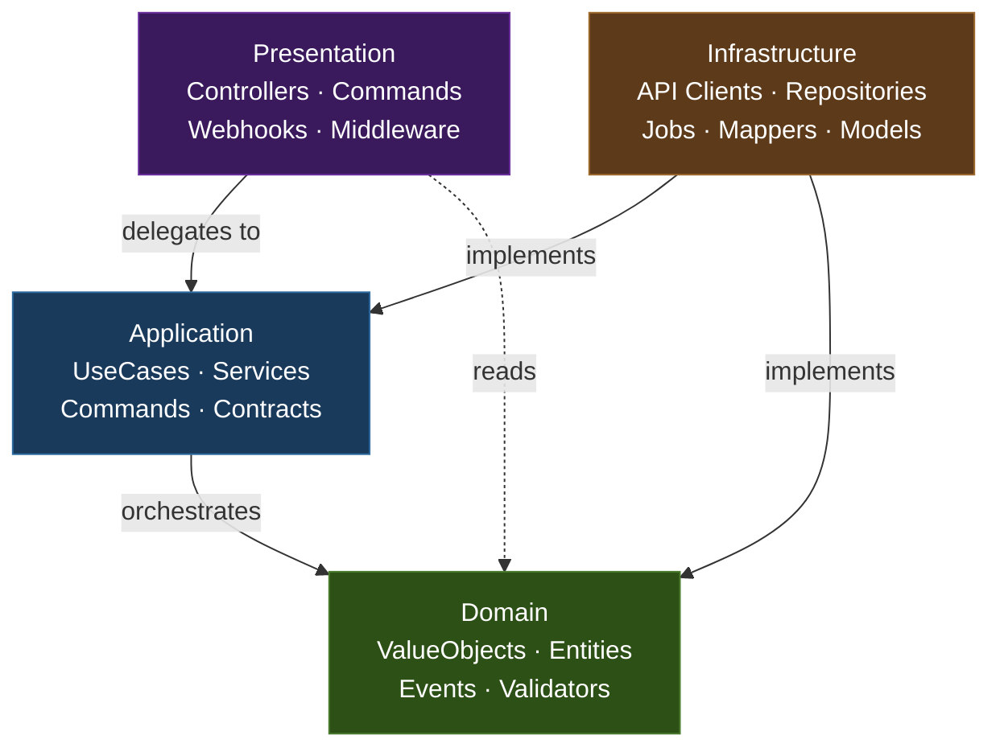

# alz-core

Production backend for a UK e-commerce business selling disability aids to individuals, businesses, and the public sector. One Laravel application serves two audiences: the Admin Dashboard that staff work in, and the public endpoints the storefront calls for contact submissions, basket snapshots, and call-tracking numbers.

Architectural rules are enforced by tooling rather than convention. Layer violations, undeclared exceptions, and unsafe job definitions fail the build instead of relying on review to catch them.

Behind that sit 12 third-party integrations, 80+ queued jobs, and 60+ scheduled tasks covering inventory, order processing, ad spend, and customer service. The system is built for correctness and maintainability in a small team, not horizontal scale.

> **Status:** Published for reference. Not accepting external contributions or issues.

## Where to start

### Documentation

- [`docs/architecture-overview.md`](docs/architecture-overview.md) for system topology, deployment, and end-to-end data flows.
- [`docs/adr/`](docs/adr/) for the eleven architectural decision records.
- [`tests/TestingStrategy.md`](tests/TestingStrategy.md) for what is tested at each layer, and what is deliberately not.

### Code

The directories that best show how the system is put together:

- `app/DevTools/PHPStan/Rules/` for the custom static-analysis rules that enforce the invariants below.
- `app/Infrastructure/Shopwired/` for the largest integration: clients, webhook handling, mappers, and repositories.
- `app/Application/Conversion/` for offline conversion uploads fanning out to per-platform adapters.
- `app/Providers/Schedule/` for the tiered sync schedule, split one provider per area.

## Key Features

### Data sync engine

Centralises data from a dozen external platforms, each with its own data model, API, and reliability, into one PostgreSQL database, and pushes selected data back out.

- **Three tiers of sync.** ShopWired webhooks trigger a re-fetch of the full entity. Cursor-based incremental syncs run every one to five minutes for orders and stock. Hourly through monthly catch-up jobs use overlapping lookback windows.
- **Freshness under finite rate limits.** 60+ scheduled tasks compete for the same API budgets. Per-service rate limiters tuned to each API, five priority queues across four Horizon supervisor tiers, and skip closures that hold quick syncs back during full-sync windows keep the fast paths fast.
- **Self-healing by design.** A missed webhook is caught by the next incremental sync rather than the next scheduled sweep. Drift syncs compare SQL views against the catalog and correct any divergence ([ADR 0007](docs/adr/0007-drift-syncs-share-template-method-base.md)).
- **Failure handling.** Transient API failures retry with backoff and honour Retry-After; permanent failures fail immediately. A per-service circuit breaker pauses that service's jobs after repeated transient failures. Three quarters of jobs are `ShouldBeUnique`.
- **Scale.** A Linnworks backfill of 115k+ orders ran for 12+ hours. The bottleneck was database latency, not API limits.

### Webhook ingestion

Webhooks are treated as notifications, not data sources. Defence in depth, outermost first:

- Per-IP rate limit before any cryptography or database work.
- HMAC signature verification with timing-safe comparison. A missing secret fails closed.
- Staleness guard discards events older than 24 hours.
- Idempotency and ordering in one indexed query: a monotonic webhook ID per subject and topic collapses duplicate and out-of-order events.
- Optimistic partial save and an immediate `200 OK`, then a queued re-fetch overwrites with authoritative API state. See [Key Engineering Decisions](#webhook-partial-save-then-re-fetch-and-reconcile).
- A daily health check alerts when the platform silently disables a webhook. Event records are kept for 90 days.

### Call tracking

Phone leads from paid ads were invisible to Google and Bing attribution; only form fills counted.

1. A visitor arriving from an ad click is shown a number from a Twilio pool, rotated round-robin, instead of the main business line.
2. The number-to-click mapping is stored as a visit.
3. An inbound call is matched to the most recent visit for that number within a six-hour window.
4. The call becomes a lead and is uploaded to Google or Bing as an offline conversion through the same pipeline as a form submission.

- **Consent first.** Visitors who decline marketing consent, or an empty pool, get the default business number.
- **No silent mis-attribution.** A call matching more than one visit is flagged as a collision and surfaced to operators.
- **Independent but unified.** Own domain model and tables, one dashboard view over both conversion sources ([ADR 0004](docs/adr/0004-call-tracking-independent-of-contact-submission.md)).

## Architecture

The codebase follows Clean Architecture, with strict and custom linting rules that enforce the layer boundaries before code reaches review.

### Layers

Dependencies point inward. Infrastructure implements the interfaces the inner layers define. Domain value objects validate their invariants in the constructor, and Spatie Laravel Data DTOs stay outside the Domain.

```mermaid
graph TD
    P["Presentation\nControllers · Commands\nWebhooks · Middleware"]
    A["Application\nUseCases · Services\nCommands · Contracts"]
    D["Domain\nValueObjects · Entities\nEvents · Validators"]
    I["Infrastructure\nAPI Clients · Repositories\nJobs · Mappers · Models"]

    P -->|delegates to| A
    A -->|orchestrates| D
    I -->|implements| A
    I -->|implements| D
    P -.->|reads| D

    style D fill:#2d5016,stroke:#4a7c2e,color:#fff
    style A fill:#1a3a5c,stroke:#2d6a9f,color:#fff
    style I fill:#5c3a1a,stroke:#9f6a2d,color:#fff
    style P fill:#3a1a5c,stroke:#6a2d9f,color:#fff
```

### Linting and tooling

Violations surface in the editor and in git hooks, not in code review.

- **PHPArkitect and Deptrac** validate layer dependencies on every commit and push.
- **PHPStan** runs at max level with bleeding edge and disallowed calls. 27 custom rules cover job resilience, exception taxonomy, complexity limits, and per-layer naming. Methods cap at four parameters, class length is tiered by layer, and cognitive complexity is limited to 10 per function.
- **Type coverage** targets 99%, and cognitive complexity limits are enforced per function.

### Invariants

Every rule below is a lint failure.

| Invariant | Enforced by |
|-----------|-------------|
| Domain depends only on PHP built-ins and `webmozart/assert` | PHPArkitect + Deptrac |
| Application and Presentation never import Infrastructure | PHPArkitect + Deptrac |
| No `DB::` facade anywhere; use `DatabaseGateway` | Custom PHPStan rule |
| No `config()` or `Config::` in Domain or Application | PHPStan |
| No static properties, because Octane persists state across requests | Custom PHPStan rule |
| Every thrown exception is declared in `@throws` and handled by every caller | PHPStan |
| SDK exception types never appear in `@throws`; they are translated to Domain exceptions at the Infrastructure boundary | Custom PHPStan rule |
| Every queue job declares `$tries`, `$timeout`, `backoff()`, `failed()`, implements `ShouldQueue`, and sets `onQueue()` | Custom PHPStan rules |
| Every table reference is schema-qualified (`auth.*`, `shopwired.*`, `public.*`) | Custom PHPStan rule |

### HTTP surfaces

The Admin Dashboard and the public endpoints share a codebase but not an access model.

| Surface | Authentication | Throttling |
|---------|----------------|------------|
| Admin Dashboard | Supabase JWT with MFA enforced and an approval gate | Per user |
| Public endpoints | Anonymous; the contact form carries a honeypot | Per IP, at a much lower rate |
| Inbound webhooks (ShopWired, Twilio) | HMAC signatures | Per IP |
| Horizon and operational routes | HTTP basic auth | None |

## Key Engineering Decisions

### No general cache in front of synced data

There is no general read-through cache. Most tables have their source of truth in a third-party system, and scheduled syncs plus webhooks keep a local copy in PostgreSQL. Reads are already local.

A cache in front of those tables would buy slightly faster reads in exchange for invalidation complexity and consistency bugs. The Octane workers already answer quickly, and the database is nowhere near its limits.

Caching is used only where an external contract requires it:

- **OAuth session tokens** for Bing Ads and Linnworks, whose providers issue short-lived tokens that must be shared across workers.
- **HelpScout read responses**, behind short and long TTLs.
- **Alert throttling**, which suppresses repeat error notifications.
- **ClickUp user identity lookups**, a small performance cache.

See [ADR 0005](docs/adr/0005-two-tier-cache-abstractions.md) for the cache abstractions and [ADR 0011](docs/adr/0011-no-general-cache-in-front-of-synced-data.md) for why nothing sits in front of synced data.

Would revisit if read latency on synced tables became a measurable constraint.

### Webhook partial-save, then re-fetch and reconcile

ShopWired webhook payloads are partial, so the full entity has to be re-fetched from the API regardless. The webhook handler therefore does the minimum work inline:

1. Persist the partial payload.
2. Return `200 OK` immediately, so the provider never times out.
3. Dispatch a re-fetch job.
4. The job pulls the full entity from the API and reconciles the stored record.

Polling therefore runs far less often, and data stays accurate inside tight external rate limits.

Would revisit if ShopWired shipped complete payloads with guaranteed ordering.

### HelpScout SDK for writes, direct HTTP for reads

The SDK's entity hydration silently drops required response fields on reads.

Writes work correctly through the SDK, so each path is used where it is reliable rather than replacing the SDK or working around its hydration.

Would revisit if HelpScout shipped an SDK version that preserves all response fields.

### Conversion uploads behind a per-platform adapter seam

Offline conversion uploads to Google Ads and Bing Ads go through a single adapter interface. Each adapter declares the conversion types it supports and reads its own click ID out of the shared attribution.

The pipeline resolves the eligible adapters per conversion instead of branching on platform name. Adding a platform is one new adapter rather than edits across every use case and job.

See [ADR 0010](docs/adr/0010-conversion-uploads-per-platform-adapters.md).

## Integrations

Each service has its own authentication model, rate limits, and data-format quirks. Those quirks stay inside the Infrastructure layer. The rest of the codebase only sees Domain types.

| Service | Role | Auth | Sync pattern |
|---------|------|------|--------------|
| ShopWired | Storefront platform | HTTP Basic; HMAC-SHA256 webhooks | Webhooks plus polling |
| Linnworks | Inventory and warehouse | OAuth 2.0 | Cursor-based incremental |
| Google Ads | Ad spend, conversion uploads | OAuth 2.0 | Scheduled pulls, event-driven uploads |
| Bing Ads | Ad spend, conversion uploads | OAuth 2.0 | Async report downloads, event-driven uploads |
| Twilio | Call tracking numbers | HMAC-SHA1 signatures | Inbound webhooks |
| HelpScout | Customer service | OAuth 2.0 | On-demand reads, SDK writes |
| Mixpanel | Product analytics | HTTP Basic | Scheduled pushes |
| Reviews.io | Product and company reviews | API key | Two-stage fetch, then push |
| ClickUp | Task management | API key, encrypted at rest | On-demand writes |
| Supabase | Auth and PostgreSQL | JWT | Shared database |
| AWS S3 | Object storage for product feed files | Access key and secret | On-demand uploads |
| Sentry | Error tracking | DSN | Outbound events |

## Tech Stack

| Concern | Technology | Notes |
|---------|-----------|-------|
| Language | PHP 8.4 | Strict types, readonly properties, enums |
| Framework | Laravel 13 | Octane (Swoole) for HTTP serving |
| Database | PostgreSQL | Via Supabase, shared with the Admin Dashboard |
| Queue | Redis + Laravel Horizon | 5 priority tiers |
| Cache | Database store by default, Redis store available | Targeted use only |
| Testing | Pest 4 | Mutation testing via Pest Mutate |
| Deployment | Docker to Railway | 3 services (web, worker, scheduler) plus a Railway-hosted Redis |
| Error Tracking | Sentry | Expected and unexpected errors filtered separately |

## Testing Strategy

The philosophy is to test what static analysis cannot catch. Coverage targets are calibrated to where bugs are most costly. Tests concentrate on business logic, state transitions, and integration boundaries.

| Layer | Targets | Focus |
|-------|---------|-------|
| Domain | 90%+ coverage and MSI | Value object invariants, validators, and transformers. Mutation testing catches tests that pass without verifying behaviour. |
| Application | 70%+ coverage and MSI | UseCase orchestration, branching, and error paths. Pure-delegation UseCases are excluded from coverage. |
| Infrastructure | Integration tests only | Live service tests where mocking would hide real failures. |
| Presentation | Smoke and feature tests | Endpoints, webhook signatures, auth middleware, rate limiting, request validation. |

## Development Workflow

Every change gets its own Linear issue, branch, and pull request, and larger work starts with a design session and an implementation plan.

### Division of labour with AI

Claude Code is the main workhorse for implementation, favouring the most capable models available.

- **Human in the loop:** a human stays heavily involved in every planning and review step.
- **Custom skills:** drive planning and implementation so each change follows the same path from issue to pull request.
- **Hard boundary:** AI-written code passes the same pre-commit and pre-push hooks as any other code.

| Area | Owner | Notes |
|------|-------|-------|
| Architecture, design, decisions, review | Human | |
| Implementation | AI | Guided by scoped rule files that encode the conventions for each part of the codebase |
| Tests | AI | Fully delegated, with mutation score rather than coverage as the quality floor. Trades hand-crafted test design for velocity, so quality is less even outside core Domain logic |
| Pull request review | CI | Informational AI review on every code pull request; it does not gate a merge |

### Documentation

Implementation plans and logs live in a local AI workspace outside this public repository. The ADRs in `docs/adr/` carry the decisions that outlive a single change.

## CI/CD Pipeline

Pull requests trigger a change-detected pipeline. Docs-only pull requests skip the expensive jobs.

| Stage | Trigger | Checks |
|-------|---------|--------|
| Pre-commit | Every commit | Pint (style), PHPStan (analysis), PHPArkitect (architecture) |
| Pre-push | Every push | Pest (tests), Deptrac (layer deps), TLint |
| CI | Pull request | Code style, Pest in parallel against PostgreSQL 17 and Redis 7, security audit, taint analysis (Psalm) |
| AI review gate | Pull request | Informational AI review, skipped on docs-only changes |
| Mutation testing | Pull request to `main` | Domain and Application MSI thresholds, informational and non-blocking |

## Known Limitations

- **No distributed tracing.** Sentry captures errors well, but request-level tracing across queue jobs and outbound API calls is not instrumented. Error volume at this scale does not justify the cost.
- **Integration tests run locally, not in CI.** Several assert against rows synced from production systems, which CI cannot provide. The unit and feature suites do run in CI against containerised PostgreSQL and Redis, so the gap is data availability rather than infrastructure.

## What's next

- Product image optimisation pipeline: two-tier Cloudflare R2 storage with derivative generation and ShopWired sync.
- QuickBooks Online integration, replacing the current Zapier-based invoice and sales-receipt sync.
- Server-side estimated delivery dates, calculated in alz-core and served to the storefront at the edge.
- B2B customer identification from order data, feeding a best-sellers list and a matched marketing audience.
