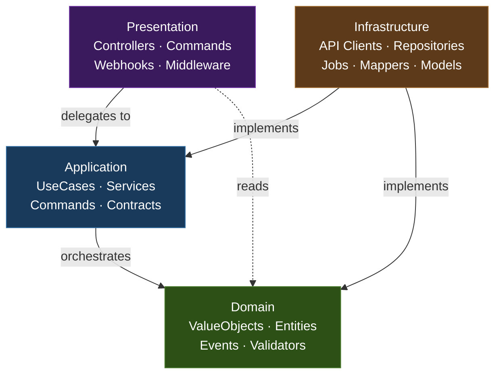

# alz-core

Production backend for a UK e-commerce business selling disability aids to individuals, businesses, and the public sector. One Laravel application serves two audiences: the Admin Dashboard that staff work in, and the public endpoints the storefront calls for contact, checkout, and call-tracking data. Architectural rules here are enforced by tooling rather than convention, so layer violations, undeclared exceptions, and unsafe job definitions fail the build instead of relying on review. Behind that sit 12 third-party integrations, 70+ queued jobs, and 60+ scheduled tasks covering inventory, order processing, ad spend, and customer service. Built for correctness and maintainability in a small team, not horizontal scale.

> **Status:** Published for reference. Not accepting external contributions or issues.

## Where to start

Documentation:

- [`docs/architecture-overview.md`](docs/architecture-overview.md) for system topology, deployment, and end-to-end data flows.
- [`docs/adr/`](docs/adr/) for the architectural decision records.
- [`tests/TestingStrategy.md`](tests/TestingStrategy.md) for what is tested at each layer, and what is deliberately not.

Code, in the order that explains the most:

- `app/DevTools/PHPStan/Rules/` for the custom static-analysis rules that enforce the invariants below.
- `app/Infrastructure/Shopwired/` for the largest integration: clients, webhook handling, mappers, and repositories.
- `app/Application/Conversion/` for offline conversion uploads fanning out to per-platform adapters.
- `app/Providers/Schedule/` for the tiered sync schedule, split one provider per area.

## Architecture

Layer boundaries are enforced by tooling, not discipline. PHPArkitect and Deptrac validate dependency rules on every commit, and 27 custom PHPStan rules cover job resilience, exception taxonomy, complexity limits, and per-layer naming. Violations surface in the editor, not in code review.

**Enforced invariants.** Every rule below fails CI:

| Invariant | Enforced by |
|-----------|-------------|
| Domain depends only on PHP built-ins and `webmozart/assert` | PHPArkitect + Deptrac |
| Application never imports Infrastructure | PHPArkitect + Deptrac |
| Presentation never imports Infrastructure | PHPArkitect + Deptrac |
| No `DB::` facade anywhere; use `DatabaseGateway` | Custom PHPStan rule `NoDbFacadeRule` |
| No `config()` or `Config::` in Domain or Application | `spaze/phpstan-disallowed-calls` |
| No static properties, because Octane persists state across requests | Custom PHPStan rule `NoStaticPropertiesRule` |
| Checked-exception semantics: every thrown exception is declared in `@throws` and propagated or caught by every caller, which PHP itself does not enforce | PHPStan `exceptions.check` (`missingCheckedExceptionInThrows`) |
| SDK exception types never appear in `@throws`; they are translated to Domain exceptions at the Infrastructure boundary | Custom rule `NoSdkExceptionsInThrowsRule` |
| Every queue job declares `$tries`, `$timeout`, `backoff()`, `failed()`, implements `ShouldQueue`, and sets `onQueue()` | Custom rules under `DevTools/PHPStan/Rules/Jobs/` |
| Every table reference is schema-qualified (`auth.*`, `shopwired.*`, `public.*`) | Custom rule `SchemaQualifiedTableNameRule` |

Supporting enforcement: PHPStan at max level with bleeding edge, a 99% type-coverage target, cognitive complexity limits, and disallowed calls (no facades in Domain or Application, no `DB::`, no `Artisan::call`).

### Layers

Dependencies point inward; Infrastructure implements the interfaces the inner layers define.

```mermaid
graph TD
    P["Presentation\nControllers · Commands\nWebhooks · Middleware"]
    A["Application\nUseCases · Services\nCommands · Contracts"]
    D["Domain\nValueObjects · Entities\nEvents · Validators"]
    I["Infrastructure\nAPI Clients · Repositories\nJobs · Mappers · Models"]

    P -->|delegates to| A
    A -->|orchestrates| D
    I -->|implements| A
    I -->|implements| D
    P -.->|reads| D

    style D fill:#2d5016,stroke:#4a7c2e,color:#fff
    style A fill:#1a3a5c,stroke:#2d6a9f,color:#fff
    style I fill:#5c3a1a,stroke:#9f6a2d,color:#fff
    style P fill:#3a1a5c,stroke:#6a2d9f,color:#fff
```

> System topology, container deployment, and end-to-end data flows: see [`docs/architecture-overview.md`](docs/architecture-overview.md).

## Key Engineering Decisions

### No general cache, targeted caching where a contract demands it

Redis caching was started, then stopped to ask what it would actually gain. Most tables have their source of truth in a third-party system, and regular syncs plus webhooks mean PostgreSQL already holds a local copy of that remote data. A general read-through cache in front of synced tables would buy slightly faster reads in exchange for invalidation complexity, consistency bugs, and maintenance burden, on a system whose Octane workers already answer quickly and which is nowhere near its database limits.

Caching exists where an external contract makes it necessary rather than convenient: OAuth session tokens for Bing Ads and Linnworks, whose providers issue short-lived tokens that must be shared across workers; HelpScout read responses, behind short and long TTLs; and transient alert throttling, which suppresses repeat error notifications. See [ADR 0005](docs/adr/0005-two-tier-cache-abstractions.md) for the cache abstractions and [ADR 0011](docs/adr/0011-no-general-cache-in-front-of-synced-data.md) for why nothing sits in front of synced data.

Would revisit if read latency on synced tables became a measurable constraint.

### Webhook partial-save, then re-fetch and reconcile

ShopWired webhook payloads are partial, so the full entity must be re-fetched from the API regardless. Webhooks persist the partial payload, return `200 OK` immediately to avoid provider timeouts, and dispatch a re-fetch job that reconciles the record. This cut polling frequency substantially while keeping data accurate inside tight external rate limits.

Would revisit if ShopWired shipped complete payloads with guaranteed ordering.

### HelpScout SDK for writes, direct HTTP for reads

The SDK's entity hydration silently drops response fields on reads. The `snooze` field needed by the dashboard widgets was being discarded. Writes work correctly through the SDK.

Rather than replacing the SDK or working around its hydration, each path is used where it is reliable. Would revisit if HelpScout shipped an SDK version that preserves all response fields.

### One application, two audiences

The Admin Dashboard and the public endpoints share a codebase but not an access model. Dashboard routes sit behind a Supabase JWT with MFA enforced and an approval gate, throttled per user. The public endpoints are anonymous, throttled per IP at a much lower rate, and the contact form carries a honeypot. Two inbound webhook channels verify signatures instead of credentials, ShopWired with HMAC-SHA256 and Twilio with its own HMAC-SHA1 scheme. Operational routes, including Horizon, sit behind HTTP basic auth and are registered outside the web middleware group so no session or CSRF state is created for them.

Keeping one application means one domain model, one queue, and one deployment. The cost is that every route must declare which surface it belongs to, which is why auth and rate limiting are configured centrally rather than per controller.

### Conversion uploads behind a per-platform adapter seam

Offline conversion uploads to Google Ads and Bing Ads go through a single adapter interface. Each adapter declares the conversion types it supports and reads its own click ID out of the shared attribution, and the pipeline resolves the eligible adapters per conversion instead of branching on platform name. Adding a platform is one new adapter rather than edits across every use case and job, and the per-platform use cases and jobs collapsed into a shared path. See [ADR 0010](docs/adr/0010-conversion-uploads-per-platform-adapters.md).

## Tech Stack

| Concern | Technology | Notes |
|---------|-----------|-------|
| Language | PHP 8.4 | Strict types, readonly properties, enums |
| Framework | Laravel 13 | Octane (Swoole) for HTTP serving |
| Database | PostgreSQL | Via Supabase; schema-qualified tables enforced by a custom rule |
| Queue | Redis + Laravel Horizon | 5 priority tiers |
| Cache | Database store by default, Redis store available | Targeted use only; see the caching decision above |
| Static Analysis | PHPStan max + bleeding edge | Larastan, shipmonk-rules, strict-rules, disallowed-calls, cognitive-complexity, type-coverage |
| Architecture | PHPArkitect + Deptrac | Layer dependency validation on every commit |
| Testing | Pest 4 + mutation testing | Layer-specific targets, Pest Mutate (180+ mutators) |
| Deployment | Docker to Railway | Multi-stage build; 3 services (web, worker, scheduler) plus a Railway-hosted Redis |
| Error Tracking | Sentry | Filtered by expected and unexpected; user context capture |
| Domain Invariants | webmozart/assert | Constructor-enforced value objects throughout the Domain layer |
| DTOs | Spatie Laravel Data | Presentation and Application boundary DTOs; Domain uses value objects |

## Integrations

Each service has its own authentication model, rate limits, and data-format quirks. Ingestion is wrapped in Domain-typed clients so the quirks stop at the Infrastructure boundary.

| Service | Role | Protocol | Auth | Sync pattern |
|---------|------|----------|------|--------------|
| ShopWired | Storefront platform | REST | HTTP Basic; HMAC-SHA256 webhooks | Webhooks plus polling |
| Linnworks | Inventory and warehouse | REST | OAuth 2.0 | Cursor-based incremental |
| Google Ads | Ad spend, conversion uploads | REST | OAuth 2.0 | Scheduled pulls, event-driven uploads |
| Bing Ads | Ad spend, conversion uploads | SOAP and REST | OAuth 2.0 | Async report downloads, event-driven uploads |
| Twilio | Call tracking numbers | REST plus inbound webhooks | HMAC-SHA1 signatures | Inbound webhooks |
| HelpScout | Customer service | REST plus SDK | OAuth 2.0 | On-demand reads, SDK writes |
| Mixpanel | Product analytics | REST | HTTP Basic | Scheduled pushes |
| Reviews.io | Product and company reviews | REST | API key | Two-stage fetch, then push |
| ClickUp | Task management | REST | API key, encrypted at rest | On-demand writes |
| Supabase | Auth and PostgreSQL | PostgreSQL wire, JWT | JWT | Shared database |
| AWS S3 | Object storage for product feed files | S3 API | Access key and secret | On-demand uploads |
| Sentry | Error tracking | HTTPS | DSN | Outbound events |

Sync runs on a tiered schedule: cursor-based incremental polling every few minutes, hourly and daily catch-up sweeps, and weekly or monthly full reconciliation, spread across roughly a dozen dedicated schedule providers.

Call tracking is the newest of these. Twilio numbers are rotated from a pool, shown to eligible visitors, and attributed to the ad click that brought them in, so a phone call can be uploaded as an offline conversion the same way a form submission is. See [ADR 0004](docs/adr/0004-call-tracking-independent-of-contact-submission.md).

## Testing Strategy

The philosophy is to test what static analysis cannot catch. With PHPStan at max level, the type-coverage target, and the custom rules, the type system already handles a class of bugs that other codebases rely on tests to find. Tests concentrate on business logic, state transitions, and integration boundaries.

| Layer | Targets | Focus |
|-------|---------|-------|
| Domain | 90%+ coverage and MSI | Pure business logic. Mutation testing catches tests that pass without verifying behaviour. Value object invariants, validators, and transformers are the priority. |
| Application | 70%+ coverage and MSI | UseCase orchestration, service logic, command handling. Tests verify branching and error paths. Pure-delegation UseCases are excluded from coverage. |
| Infrastructure | Integration tests only | Live service tests where mocking would hide real failures. No mutation testing. |
| Presentation | Smoke and feature tests | HTTP endpoints, webhook signature verification, auth middleware, rate limiting, request validation. |

## Development Workflow

**Branching.** Feature branches merge into `develop`, and `develop` into `main`. Linear history is enforced by squash and rebase merges, with GitHub rulesets preventing direct pushes.

**Feature development** scales with scope:

- **Small:** scoped in conversation, implemented autonomously, reviewed manually.
- **Medium:** design session, then an implementation plan, then a Linear issue, then autonomous implementation in fresh context, then human review and iteration.
- **Large:** organised as Linear projects with blocking dependencies and milestones.

Every change, regardless of size, gets its own Linear issue, branch, and pull request.

**Division of labour with AI.** Architecture, design, decisions, and review are human-owned. AI does implementation, working inside around 30 scoped rule files that encode layer constraints, naming conventions, and per-file patterns, with the linters as the hard boundary. Test implementation is fully delegated, with the mutation score rather than coverage acting as the quality floor. The CI review gate runs an AI review on every code pull request, but it is informational and does not gate a merge.

**Documentation.** Around 200 technical plan documents and around 180 implementation logs record decision context across the project's lifetime. They live in a local AI workspace outside this public repository, which is why the ADRs in `docs/adr/` carry the decisions that outlive a single change.

## CI/CD Pipeline

Pull requests trigger a change-detected pipeline; docs-only pull requests skip the expensive jobs.

| Stage | Trigger | Checks |
|-------|---------|--------|
| Pre-commit | Every commit | Pint (style), PHPStan (analysis), PHPArkitect (architecture) |
| Pre-push | Every push | Pest (tests), Deptrac (layer deps), TLint |
| CI | Pull request | Code style, Pest in parallel against PostgreSQL 17 and Redis 7, security audit, taint analysis (Psalm) |
| AI review gate | Pull request | `.github/workflows/review-gate.yml`, informational, skipped on docs-only changes |
| Mutation testing | Pull request to `main` | Domain and Application MSI thresholds, informational and non-blocking |

## Known Limitations

- No distributed tracing. Sentry captures errors well, but request-level tracing across queue jobs and outbound API calls is not instrumented, and error volume at this scale does not justify the cost.
- Integration tests run locally, not in CI. Several assert against rows synced from production systems, which CI cannot provide. The unit and feature suites do run in CI, against containerised PostgreSQL and Redis, so the gap is data availability rather than infrastructure.

Decision records are not a gap: eleven ADRs in [`docs/adr/`](docs/adr/) record the reasoning behind the calls above, including the ones this README summarises.

## What's next

- Product image optimisation pipeline: two-tier Cloudflare R2 storage with derivative generation and ShopWired sync.
- QuickBooks Online integration, replacing the current Zapier-based invoice and sales-receipt sync.
- Server-side estimated delivery dates, calculated in alz-core and served to the storefront at the edge.
- B2B customer identification from order data, feeding a best-sellers list and a matched marketing audience.
