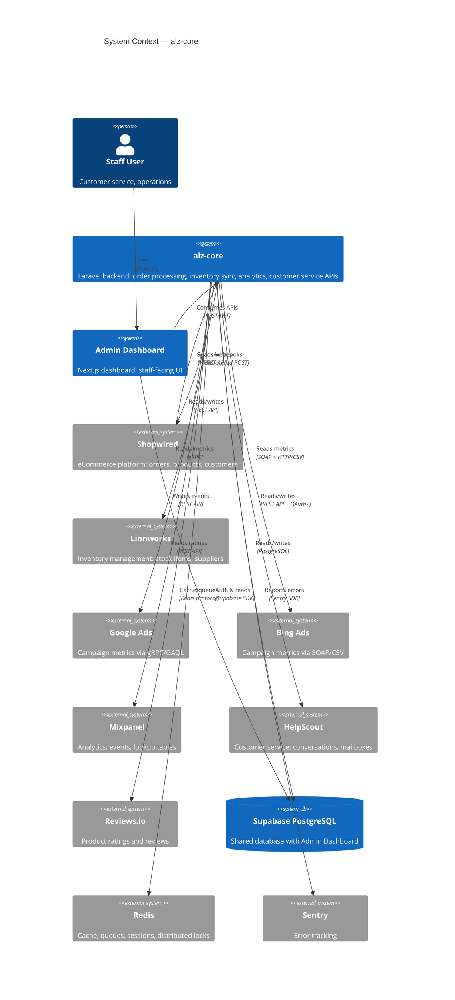
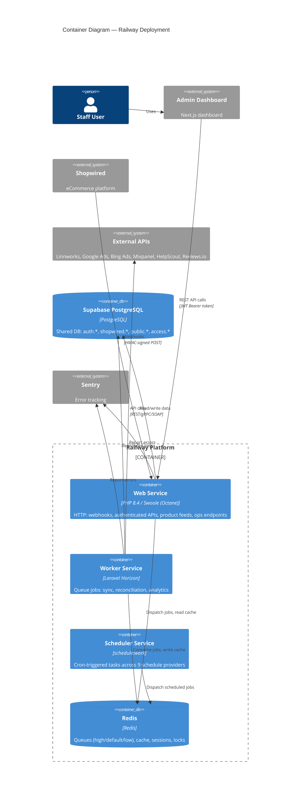
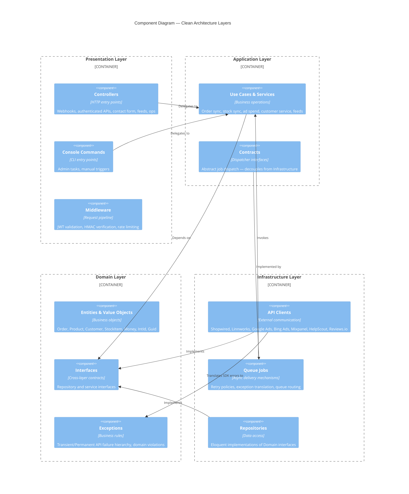
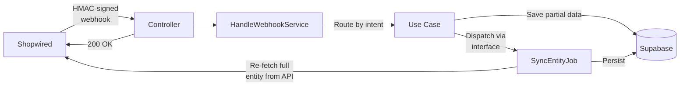
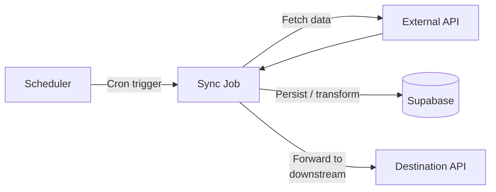
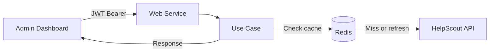
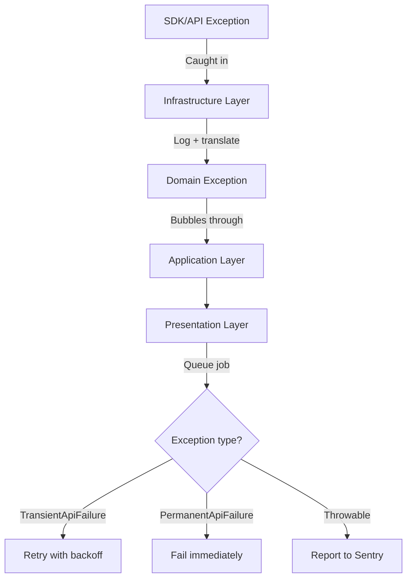

# Architecture Overview

Visual guide to alz-core's system structure. For implementation details, see [CLAUDE.md](../../CLAUDE.md) and layer-specific CLAUDE.md files.

---

## 1. System Context

Where alz-core sits in the broader ecosystem.



**Key relationships:**
- **Shared database** — alz-core and the Admin Dashboard share the same Supabase PostgreSQL. Supabase manages `auth.*`; Laravel manages `shopwired.*` and `public.*`.
- **Webhook-driven** — Shopwired pushes real-time events via HMAC-signed webhooks. alz-core saves the partial payload, then dispatches a job to re-fetch the full entity from the API.
- **Analytics pipeline** — Order and ad spend data flow into Mixpanel via scheduled jobs.

---

## 2. Container Diagram (Railway)



Three queue priority tiers (`high`, `default`, `low`) route jobs by urgency. See `config/horizon.php` for current timeouts and worker config.

---

## 3. Clean Architecture Layers

```
Presentation → Application → Domain ← Infrastructure
                                ↑           |
                                └───────────┘
                              (implements interfaces)
```



**Rules:** Domain depends on nothing. Application depends only on Domain. Infrastructure implements Domain interfaces. Presentation calls Application, never Infrastructure directly. Interfaces live where they're **used**, not where they're implemented.

---

## 4. Key Data Flows

### Webhook → Re-fetch Pattern (orders, products, customers, etc.)



Webhooks save the partial payload synchronously, dispatch a single re-fetch job, and return immediately. Downstream analytics and cross-system syncs run on their own schedules.

### Scheduled Sync Pattern (inventory, ad spend, analytics)



Nine schedule providers orchestrate background work: Shopwired entity syncs, Linnworks stock/order sync, inventory push to Shopwired, ad spend to Mixpanel, product feeds, Reviews.io ratings, and queue maintenance.

### Customer Service (request-driven)



---

## 5. Exception Flow



Infrastructure catches SDK exceptions, logs technical details, and translates to domain exceptions. Application doesn't catch — exceptions bubble to Presentation, which handles delivery (HTTP responses, queue retry logic).

---

## Further Reading

- [CLAUDE.md](../../CLAUDE.md) — Project conventions, layer rules, development setup
- [tests/TestingStrategy.md](../../tests/TestingStrategy.md) — What to test per layer
- [docs/guides/critical-pitfalls.md](guides/critical-pitfalls.md) — Date range and sync pitfalls
- [docs/deployment/railway-octane-setup.md](deployment/railway-octane-setup.md) — Railway deployment details
- Layer-specific CLAUDE.md files in `app/Domain/`, `app/Application/`, `app/Infrastructure/`, `app/Presentation/`
